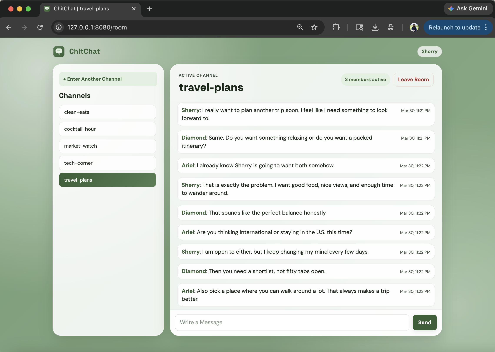
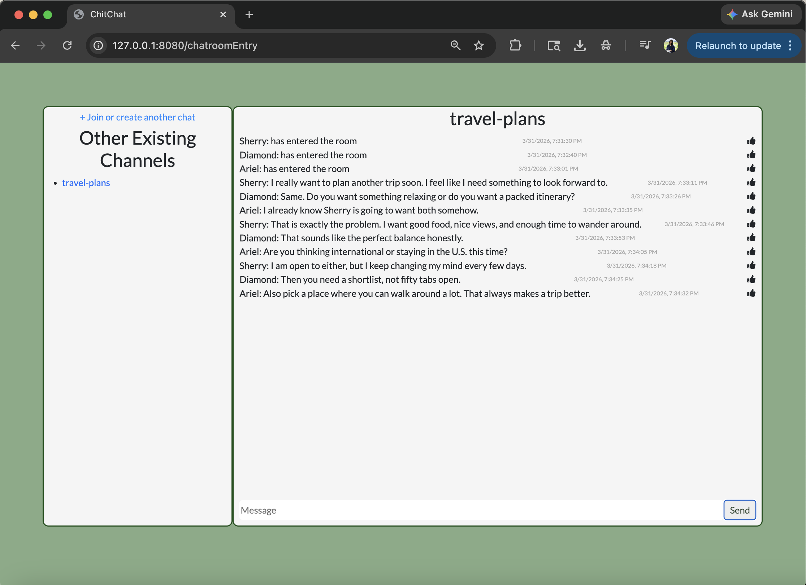

# ChitChat RT

ChitChat RT is a real-time multi-room chat application where users pick a display name, join channels by code, and exchange messages instantly over WebSockets.

***NOTE**: Originally built from scratch in 2023. In 2026, I used AI-assisted development tools to help refactor, modernize, and improve parts of the codebase, including backend fixes and a more polished UI. The architecture, product decisions, and final implementation choices remained mine.*

### Current Version


### Original Version


The modernization transformed ChitChat through a major architectural refactor, extensive backend logic fixes, and a complete UI overhaul, making the app significantly more maintainable, reliable, and polished end to end.

## Features
- Branded display-name and channel-entry flow
- Create or join channels by code
- Real-time messaging with Flask-SocketIO
- Session-scoped channel list with quick switching
- Live presence count and unread channel badges
- SQLite-backed room and message persistence

## Technologies
- **Languages:** Python, JavaScript, HTML, CSS
- **Frameworks/Libraries:** Flask, Flask-SocketIO
- **Realtime:** Socket.IO client
- **Database:** SQLite

## Setup
1) Create and activate a virtual environment.
```bash
python3 -m venv .venv
source .venv/bin/activate
```
2) Install dependencies.
```bash
pip install -r requirements.txt
```
3) Configure environment variables.
```bash
cp .env.example .env
```
Set `SECRET_KEY` in `.env` before starting the app. `DATABASE_PATH` is optional and defaults to `instance/chitchat.db`.

4) Run the app.
```bash
python3 application.py
```
5) Open the app in your browser.
```text
http://localhost:8080
```

## Usage
1. Enter a display name.
2. Join or create a channel with a channel code.
3. Send messages in real time.
4. Switch between joined channels from the sidebar or the `Enter Another Channel` modal.

## Persistence
By default, ChitChat RT stores data in `instance/chitchat.db`.

- Room and message history persist across server restarts
- Live presence counts do not persist across restarts
- Joined-channel sidebar state is stored per browser session
- Unread badges are calculated client-side from joined-room message counts and local seen state

## Known Limitations
- Display names are not unique within a room, so multiple users may appear with the same name in chat
- The app is session-based and does not include authentication or persistent user accounts
- Channel codes are not discoverable in the app and must be shared externally to join a room

## Tests
The project includes unit tests for room entry behavior, room validation, session-scoped channel visibility, Socket.IO session/message validation, unread-channel events, and SQLite storage behavior.

```bash
.venv/bin/pytest
```
